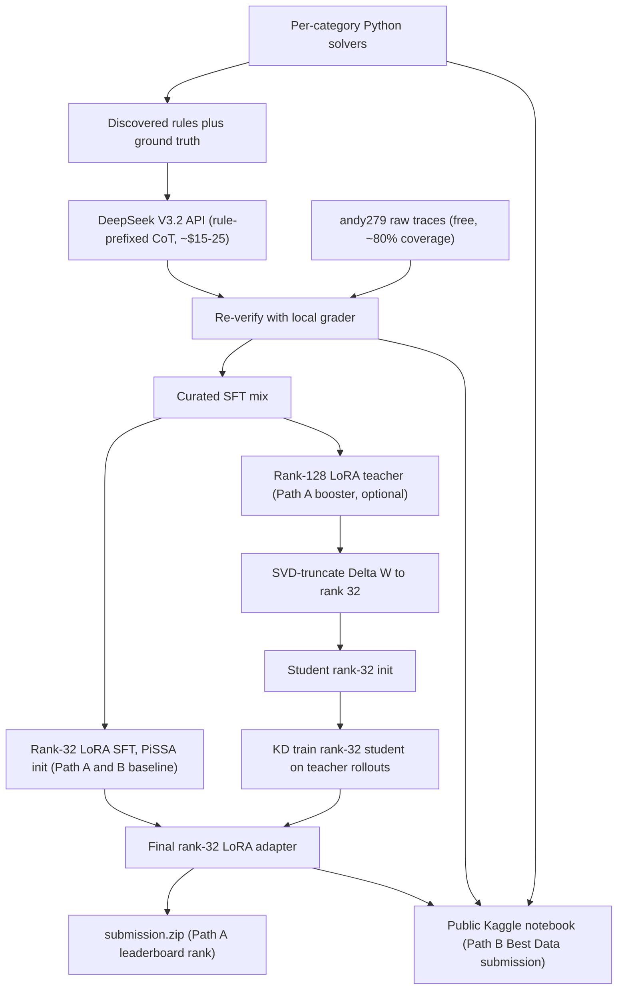

# Nemotron Reasoning Challenge — DGX Spark Plan

**Canonical copy:** this file lives in-repo at `docs/NEMOTRON_PLAN.md`.  
Cursor may also hold a mirror under `.cursor/plans/`; treat **this** path as the source of truth for Git history.

---

## Progress snapshot (updated after Phase 0 scaffold)

| Phase | Status | Notes |
|-------|--------|--------|
| **Phase 0 — Foundation** | **Mostly complete** | Code + tests + packaging in repo; HF download + Kaggle smoke submission still on you |
| Phase 1 — SFT baseline | Not started | `train/sft.py` TBD |
| Phase 2 — Solvers + synthetic data | Not started | `solvers/*.py` TBD |
| Phase 3 — High-rank → SVD → KD | Not started | Optional Path A booster |
| Phase 4 — Notebook + submission | Not started | Path B deliverable |

### Phase 0 completed in-repo

- **Layout:** `data/`, `solvers/`, `train/`, `eval/`, `teacher/`, `submit/`, `notebook/`, `configs/`, `scripts/` + per-folder READMEs.
- **Grader:** [`eval/grader.py`](../eval/grader.py) — verbatim `extract_final_answer` + `verify` from the competition metric (community copy cross-checked). [`eval/test_grader.py`](../eval/test_grader.py) — **40 pytest cases**, all passing locally.
- **Greedy eval skeleton:** [`eval/greedy_harness.py`](../eval/greedy_harness.py) — vLLM params aligned with kernel (`max_lora_rank=32`, `max_model_len=8192`, `temperature=0.0`, `max_tokens=7680`). Runs on **Linux GPU** (V100 server / Kaggle), not Windows dev box.
- **Data:** [`data/download.py`](../data/download.py) — pulls andy279 SFT + raw-traces (requires `HF_TOKEN` + dataset ToS clicks).
- **Teacher:** [`teacher/deepseek_client.py`](../teacher/deepseek_client.py) + [`teacher/smoke_test.py`](../teacher/smoke_test.py).
- **Submit:** [`submit/package.py`](../submit/package.py) — builds `submission.zip` with pre-zip validation (`r≤32`, `peft_type=LORA`, safetensors parse).
- **Tooling:** `requirements.txt`, `requirements-train.txt`, `pyproject.toml` (ruff + pytest), `.gitignore`, `.env.example`.
- **Git:** initial commit on `main` — **`e81f24f`** (“Phase 0 scaffold…”).

### Phase 0 still outstanding (your checklist)

1. Accept HF gated datasets (click-through on both repo pages); set `HF_TOKEN` in `.env`.
2. Run `python -m data.download` (~1.4 GB).
3. Run `python -m teacher.smoke_test` (DeepSeek key in `.env`).
4. **Optional but planned:** vendor or clone [tonghuikang/nemotron](https://github.com/tonghuikang/nemotron) beside this repo for Phase 1 recipe parity.
5. **Kaggle:** smoke `submission.zip` through the competition pipeline once a LoRA exists (empty adapter first if demo allows).

**Original Phase 0 exit:** local grader agrees with Kaggle ≤ ~0.5% on a known baseline — **blocked until** (4)+(5) above.

---

## Goal: win at least one DGX Spark (singular focus)

The plan is *not* trying to maximize leaderboard ceiling. It is trying to maximize the probability of landing one DGX Spark, period. That changes phase weighting: data and notebook quality dominate; ceiling-chasing risk-takes are removed.

Two paths to the same prize, with explicit ranking by EV:

- **Path B (lead) — Best Data/Synthetic Data Method Open Contribution Award.** 1 DGX Spark, gated only on (i) top 10% leaderboard finish and (ii) winning the Best Data category against other submissions. Picked as lead because: (a) "top 10% + best in 1 of 3 categories" is materially easier than "top 3 absolute"; (b) rule-induction puzzles are uniquely well-served by solver-driven synthetic data — the natural fit for our centerpiece work; (c) the public progress-prize solution already validates the leverage; (d) the public notebook is required anyway, so structuring it as a Best Data submission is near-zero marginal cost.
- **Path A (parallel) — Top ~5-8 final leaderboard.** 8 DGX Sparks are awarded across 1st (5), 2nd (2), and 3rd (1), with a hard cap of 1/person and a cascade rule that pushes unallocated Sparks to the next-ranked team. For a solo competitor, the realistic landing zone is rank 5-8 depending on top-team composition. Phases 1-3 produce a strong leaderboard submission as a byproduct of Path B work.

Removed from scope:

- Open Progress Prize (April 9 cutoff already passed).
- Best RL Method and Best FT Method awards (lower fit; Phase 3's KD work could in principle support a Best FT entry but specializing for two categories splits focus).
- RL polish phase (variance > expected gain under greedy eval; doesn't directly improve either DGX Spark path).

---

## Hard constraints (binding)

- Base: `nvidia/NVIDIA-Nemotron-3-Nano-30B-A3B-BF16` (locked).
  - **Mamba-Transformer hybrid (Nemotron-H architecture)**, MoE, 30B total / 3B active.
  - LoRA `target_modules` are `backbone.layers.{i}.mixer.in_proj` and `backbone.layers.{i}.mixer.out_proj` on the Mamba mixer layers — **not** the standard `q,k,v,o,gate,up,down` set.
  - The public progress-prize solution flagged a known **Unsloth hang** on this model's ~5980 modules; use `peft.get_peft_model()` directly with explicit `target_modules`.
- Serving: vLLM, `max_lora_rank=32`, `max_model_len=8192`, `max_tokens=7680`, `max_num_seqs=64`, `gpu_memory_utilization=0.85`.
- **`temperature=0.0, top_p=1.0` → strictly greedy decode.** No test-time sampling, self-consistency, or majority-vote. All gains must come from the adapter.
- Submission: `submission.zip` containing PEFT LoRA + `adapter_config.json` + `adapter_model.safetensors` at zip root.
- Metric: greedy → `extract_final_answer` (boxed-first, heuristic fallbacks) → numeric path with `math.isclose(rel_tol=1e-2, abs_tol=1e-5)` if both sides parse as float, otherwise case-insensitive string equality. **No whitespace normalization beyond `.strip()` on stored vs predicted** — leading zeros, signs, units, decimal precision must match exactly for non-numeric paths.
- Public Kaggle notebook + write-up are mandatory for prize eligibility.
- Hardware: 4× Tesla V100 (Volta, fp16 only, no bf16/fp8, no flash-attn v3); typically reached via **JupyterHub** — [JUPYTERHUB.md](JUPYTERHUB.md). Kaggle Blackwell 96GB notebook (30 hr/week) for kernel eval / fallback.
- Competition deadlines: see [Kaggle timeline](https://www.kaggle.com/competitions/nvidia-nemotron-model-reasoning-challenge) (final submission typically mid-June).

---

## Anchor references

- Public progress-prize-winning solution: [github.com/tonghuikang/nemotron](https://github.com/tonghuikang/nemotron) — fork baseline for Phase 1.
- Cleaned SFT data (49,290 examples / 7,200 puzzles): [andy279/nemotron-reasoning-challenge](https://huggingface.co/datasets/andy279/nemotron-reasoning-challenge).
- Raw teacher traces (~1.02 GB): [andy279/nemotron-reasoning-challenge-raw-traces](https://huggingface.co/datasets/andy279/nemotron-reasoning-challenge-raw-traces).
- Validation: 1,165 examples; **399 transformation puzzles unsolved by any public teacher** — leaderboard differentiator.

---

## Architecture and data flow



---

## Phase checklist (high level)

- [x] **Phase 0:** scaffold, grader port + tests, download script, DeepSeek client, submit packaging, greedy harness skeleton
- [ ] **Phase 1:** SFT baseline + **week-1 leaderboard submission**
- [ ] **Phase 2:** solvers + synthetic data + intermediate submissions
- [ ] **Phase 3:** optional rank-128 teacher → SVD → KD
- [ ] **Phase 4:** public notebook + write-up + Open Contribution form + final zip

---

## Phase 0 — Foundation (days 1-3)

*(Implementation detail: see “Phase 0 completed in-repo” above; remainder is original intent.)*

- Repo scaffold: `data/`, `solvers/`, `train/`, `eval/`, `submit/`, `notebook/`.
- Pull both HF datasets and optionally mirror the public solution repo. Schema sanity check on `all_traces_merged.jsonl`:

```json
{"id": "001b24c4", "prompt": "...", "ground_truth": "XXXVIII",
 "attempts": [{"predicted_answer": "XXXVIII", "is_correct": true,
   "is_correct_official": true, ...}]}
```

- **Metric:** `extract_final_answer` + `verify` in [`eval/grader.py`](../eval/grader.py). When reconciling HF traces with leaderboard scores, prefer **`is_correct_official`** for parity with Kaggle’s shipped grader (HF docs note a divergence on binary-string edge cases).

**Exit:** local grader agrees with Kaggle scoring to ≤ ~0.5% on a known-baseline submission *(pending Kaggle smoke run)*.

---

## Phase 1 — SFT baseline + early submission milestone (days 3-7)

- Fork / align with [tonghuikang/nemotron](https://github.com/tonghuikang/nemotron); replicate config on 4x V100.
- LoRA `r=32` with **PiSSA initialization** on Mamba mixer projections. Layer indices per public MAMBA_MODULES list: 0, 2, 4, 7, 9, 11, 14, 16, 18, 21, 23, 25, 28, 30, 32, 35, 37, 39, 41, 44, 46, 48, 50.
- Training stack: TRL + PEFT (direct, **not Unsloth**) + bitsandbytes QLoRA + DeepSpeed ZeRO-2; fp16 + grad scaler on V100.
- 2-3 epochs over cleaned andy279 SFT mix; cosine LR.
- MoE-on-V100 risk: time-box fallback to Kaggle Blackwell or cloud burst by **day 4**.

**Hard milestone — end of week 1:** ship a real `submission.zip` to the leaderboard.

**Exit:** accuracy at or above public progress-prize ballpark **and** live leaderboard entry.

---

## Phase 2 — Solver-guided synthetic data (days 7-22)

Centerpiece for both DGX paths. Per-category solvers → rule-prefixed DeepSeek CoT → filter with `eval.grader`.

**Teacher pipeline (locked):** andy279 raw traces (free bulk) + DeepSeek V3.2 API for new traces (~$15-25 budget).

**Exit:** validation accuracy up vs Phase 1 (especially transformation); solver code + cracked examples ready for Phase 4 notebook.

---

## Phase 3 — High-rank teacher → SVD init → KD (days 22-29, optional)

Path A booster. Cut if it steals time from Phase 4 notebook quality.

**Exit decision day 29:** if KD ≤ Phase 2 SFT on validation, ship Phase 2.

---

## Phase 4 — Public notebook, write-up, final submission (days 29-39)

Path B deliverable: notebook *is* the Best Data submission.

Artifacts: `submission.zip` + public Kaggle notebook + write-up + Open Contribution Award form (“Best Data/Synthetic Data Method”).

---

## Risk register

- MoE on V100 slow → fallback Blackwell / burst (decide by day 4).
- Grader / formatting quirks → lean on verbatim [`eval/grader.py`](../eval/grader.py) + tests.
- Transformation tail hard → partial wins still count for leaderboard + notebook story.
- Rank-32 ceiling → Phase 3 if time permits.
- Greedy-only → no test-time sampling budget.
- Best Data contested → differentiate on unsolved-tail cracks + reproducibility + ablations.
- Notebook timing → start drafting mid Phase 4 window.

---

## Resolved open items (was blocking execution)

- **V100 server:** Linux + adequate interconnect — **confirmed** by team.
- **DeepSeek API:** account + key — **confirmed** set up.

Remaining operational items: HF ToS + `python -m data.download`, then Phase 1 training scripts.
